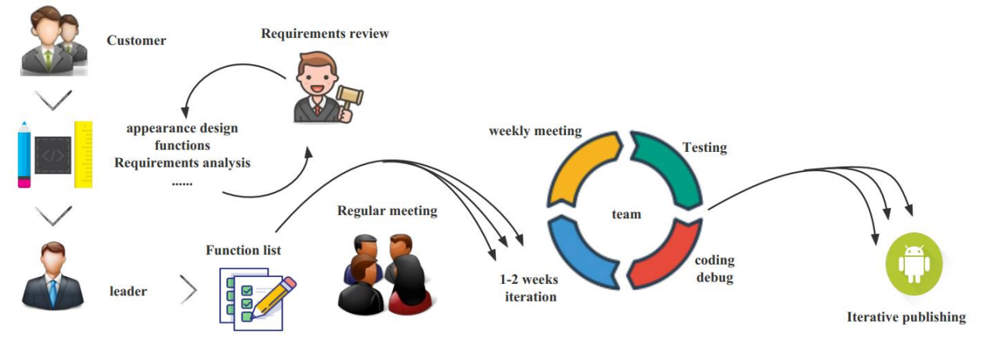

# 2023-spring-Aberdeen-4-Medical
2023移动智能应用开发项目

# How to run the apk file?

由于不同手机数据库不同，请按照视频中的方式创建医院账户，进行攻略发布，路线发布等操作后再创建患者账户或直接在主页面查看医院攻略数据

# Introduction

### Basic information		

Welcome to Hospital Guide app. The app is designed to provide a convenient way to help you find the necessary guidance services in the hospital. The app provides the following features:

- Inquire hospital ward guide
- Understand hospital procedures
- Under the guidance of APP, finish seeing  the doctor efficiently

### System Requirements

- Android 5.0 or higher

# Detailed description

### Hospital organizations and doctors

​	Update the hospital's medical information at any time on the APP, and provide patients with detailed guidance on various medical procedures

### Patients

​	Go to the designated hospital according to personal needs, and complete various hospital affairs such as seeing a doctor, taking medicine and so on under the guidance of APP guidelines

### Businessman

​	According to consumer demand, can be appropriate advertising placement. It provides a stable guidance platform for hospitals through APP operation and maintenance, and charges certain fees

### Organization Structure

	

Our company has 4 members , they are from School of  Aberdeen Data Science and Artificial Intelligence, South China Normal University

- **Senior manager:**Hua Yi Lai
- **Developer:**BoNan Mai、YinYi Liu
- **Project manager:**PeiBin Zheng
